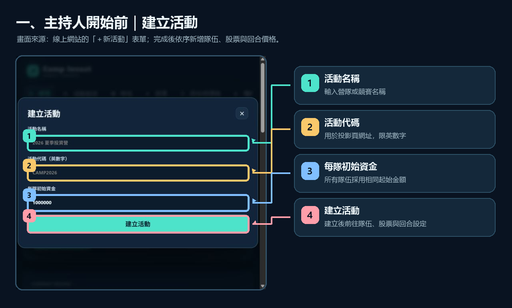
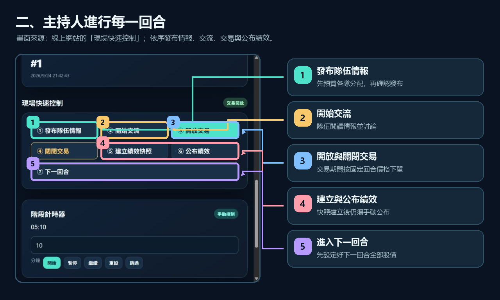
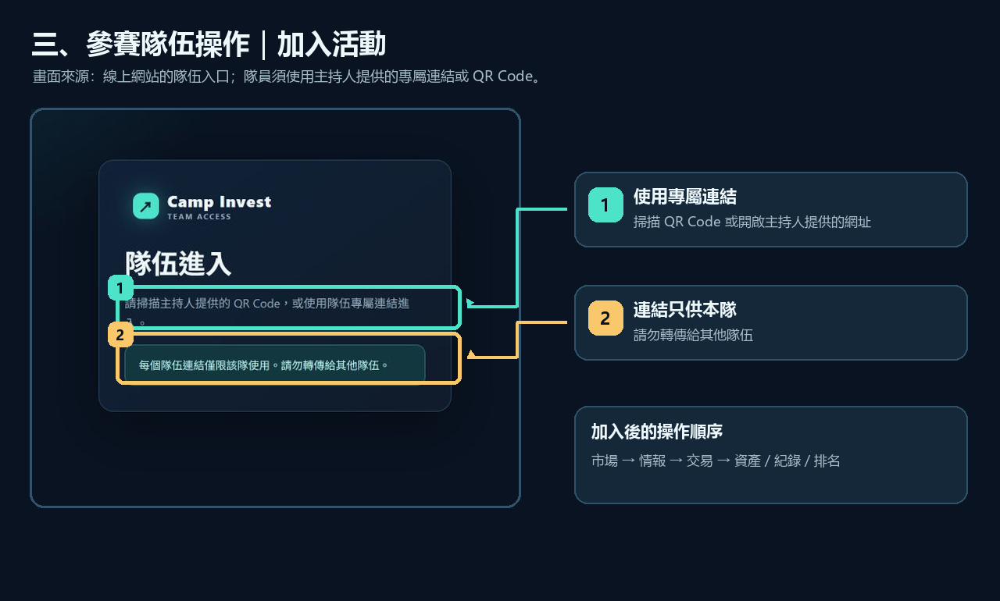

# 營隊模擬投資競賽平台｜使用操作說明

線上網站：<https://haitai.pythonanywhere.com>

本說明適用於主持人與參賽隊伍。主持人使用 /admin 管理活動；各隊使用主持人提供的專屬加入連結；投影設備使用活動的公開展示頁。

## 一、主持人開始前

圖中的方框與箭頭依序標出建立活動的四個欄位與按鈕。

1. 開啟[主持人後台](https://haitai.pythonanywhere.com/admin)，輸入管理員密碼登入。
2. 選擇「＋新活動」，填寫活動名稱、活動代碼及每隊初始資金。活動代碼限英文字母、數字、連字號和底線；建立後會用於投影網址。
3. 在「隊伍」新增所有參賽隊伍。新增後按該隊的「產生新連結 / QR」，將專屬連結或 QR Code 私下交給該隊。
4. 在「股票」建立本次活動使用的虛構股票，填入股票代號、公司名稱及提供給隊伍的背景或財務資料。
5. 在「回合與價格」依序新增回合，並為每個回合、每支股票設定固定價格。所有股票都要有該回合價格，才能進入該回合。已開始的回合不能修改價格。
6. 在「情報」建立情報，選擇回合、類型和接收隊伍。PRIVATE 給單隊、GROUP 給多隊、PUBLIC 給所有隊伍。情報可先準備好，之後再發布。

建議先完成隊伍、股票、所有回合與價格設定，再開始遊戲。每隊使用一台裝置較容易維持登入狀態和協作。

## 二、主持人進行每一回合

方框與箭頭標出總覽頁的現場快速控制；下方另有階段計時器。

1. 回到「總覽」，按「進入下一回合」。系統會套用該回合已設定的固定股價。
2. 在「情報」檢查本回合情報。若要隨機分配，按「隨機分配」並設定每隊取得則數；隨機分配會取代尚未發布的分配。
3. 按「預覽本回合分配」，確認每隊收到的情報正確，再按「確認發布」。已發布的情報無法更換接收隊伍；如需修正，請另建更正情報。
4. 在「總覽」按「開始交流」，讓隊伍閱讀情報並自行討論。此時隊伍不能交易。
5. 按「開放交易」後，隊伍才可以下單。交易結束時按「關閉交易」。若活動設定選擇自動關閉，計時器結束時會自動關閉交易；手動模式則由主持人控制。
6. 可在總覽設定計時分鐘數，並使用「開始」、「暫停」、「繼續」、「重設」或「跳過」。
7. 需要公布中途排行時，按「建立績效快照」，選擇顯示層級。快照建立後尚未公開；到「績效快照」檢視結果，再按「公布」。投影頁和隊伍排名頁只會顯示已公布的快照。
8. 重複上述流程直到最後一回合。建立快照時勾選「最終快照」會鎖定最終成績並結束活動；建立後仍需到快照清單按「公布」。

活動設定可選擇是否開放「最終績效報告」及「情報復盤」。情報復盤會展示各隊實際收到的情報，建議活動結束後再開放。

## 三、參賽隊伍操作

隊伍入口畫面會提示使用專屬連結或 QR Code；請勿將連結轉傳給其他隊伍。

1. 開啟主持人交付的專屬隊伍連結或掃描 QR Code。首次使用後會建立該隊登入狀態，之後可繼續使用同一台裝置。
2. 「市場」查看目前回合、階段、可用現金、持股市值、股票價格與公開資訊。選擇股票可查看公司資料和價格走勢。
3. 「情報」查看本隊已收到的私人或群組情報，以及公開情報。隊伍之間的交流由參賽者自行進行。
4. 主持人開放交易時，進入股票詳情，選擇買入或賣出並輸入股數，再確認交易。成交價為本回合固定價格；現金或持股不足時，系統會拒絕下單。
5. 「資產」查看現金、持股、市值與目前總資產；「紀錄」查看交易明細；「排名」查看主持人最近一次公布的快照。
6. 最終報告或情報復盤須由主持人在活動設定開放後才能查看。

## 四、投影畫面

在主持人「總覽」按「開啟投影畫面」，或開啟 https://haitai.pythonanywhere.com/presenter/活動代碼。投影頁只顯示公開情報、目前市場資訊和已公布績效，不會顯示隊伍專屬情報。

## 五、批次匯入

在「匯入」頁可匯入 UTF-8 CSV 或 XLSX（讀取第一個工作表）。請先建立相應回合、股票和隊伍，再匯入資料。

股價表第一欄為 Round，其餘欄名使用股票代號：

    Round,NT01,GP01
    1,100,80
    2,120,75

情報表每列建立一則指定隊伍的私人情報；Team 欄的隊名須與後台完全相同：

    Round,News,Team,Content
    2,產品突破,第一隊,測試結果優於預期
    2,供應商延遲,第二隊,主要供應商可能延遲交貨

## 六、帳號、連結與資料

- 管理員密碼只供主持人使用，請勿放在公開頁面或分享給參賽隊伍。隊伍加入連結含有該隊登入憑證，只交給對應隊伍。
- 重新產生某隊連結會使該隊舊連結及既有登入狀態失效。
- 活動交易資料存在主機 SQLite 資料庫 camp.db，不會因重新載入網站而清除。請勿把資料庫提交到 GitHub。
- 免費 PythonAnywhere 網站每月須登入帳號，在 Web 設定頁按「Run until 1 month from today」延長運作期限；主機會在停用前寄送提醒。
- 建議每次營隊結束後，從 PythonAnywhere 檔案頁下載 camp.db 備份並妥善保存。資料庫內含活動與隊伍資料，勿公開分享。
- 需要移除活動時，在「活動設定」頁最下方按「刪除這個活動」，再輸入畫面顯示的活動代碼確認。刪除會永久移除該活動的隊伍、情報、持股、交易與績效快照；請先備份需要保留的資料。
